# EasyInvest

### Startup Investment Platform

EasyInvest is a full-stack startup investment platform that connects
founders and investors through role-based workflows for startup
discovery, investment management, investor engagement, and
communication.

[](https://www.oracle.com/java/)
[](https://spring.io/projects/spring-boot)
[](https://spring.io/projects/spring-security)
[](https://angular.dev/)
[](https://www.mysql.com/)
[](https://maven.apache.org/)

<p align="center">
  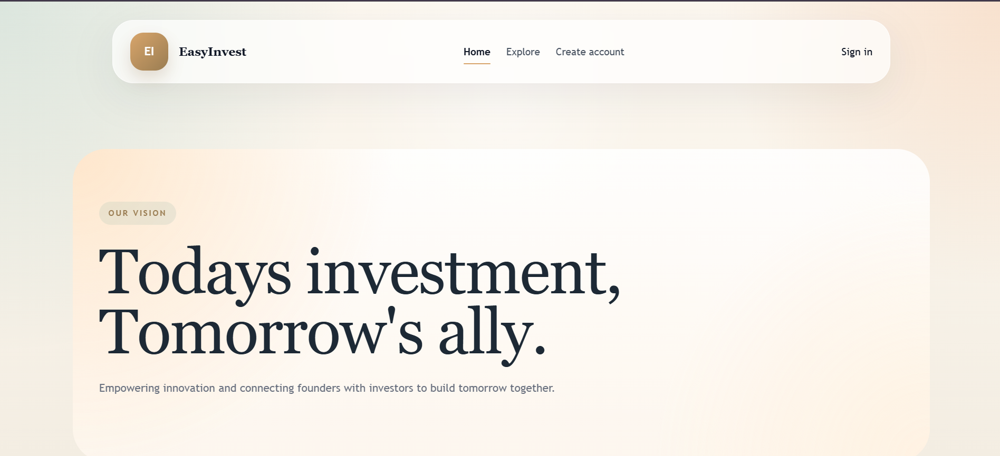
</p>
```

------------------------------------------------------------------------

## Overview

EasyInvest models a startup investment ecosystem in which founders can
present and manage startup opportunities while investors can discover,
evaluate, save, follow, and invest in startups.

The application combines:

-   A Spring Boot REST backend
-   An Angular 17 frontend
-   MySQL persistence
-   Spring Security
-   JWT-based authentication
-   Role-based authorization
-   Domain-specific REST APIs
-   Automated backend and frontend tests

The project was built to demonstrate practical full-stack engineering
concepts, including layered architecture, authentication, authorization,
business rules, persistence, API design, and role-specific user
workflows.

------------------------------------------------------------------------

## Core Features

### Authentication and Authorization

-   User registration and login
-   JWT-based authentication
-   Stateless Spring Security configuration
-   Role-based authorization
-   Protected REST APIs
-   Angular authentication guard
-   Angular role guard
-   JWT HTTP interceptor
-   Password hashing

### Startup Management

-   Create and manage startup profiles
-   Startup discovery
-   Startup search and filtering
-   Industry classification
-   Funding requirements
-   Funding progress tracking
-   Startup updates
-   Startup document management
-   Startup investor relationships

### Investment Management

-   Startup investment workflow
-   Investment history
-   Funding progress
-   Investor-to-startup investment relationships
-   Business-rule validation around investment operations

### Investor Engagement

-   Bookmark startups
-   Follow startups
-   Investor interest
-   Saved startups
-   Startup filtering by investment criteria
-   Top-funded startup views

### Communication

-   Founder-investor conversations
-   Messaging
-   Meeting requests and status management
-   Notifications

### Role-specific Workspaces

-   Investor dashboard
-   Founder dashboard
-   Administrative dashboard
-   Role-aware navigation and protected routes

------------------------------------------------------------------------

## User Roles

  -----------------------------------------------------------------------
  Role                                Primary Responsibilities
  ----------------------------------- -----------------------------------
  Founder                             Create and manage startups, provide
                                      business and funding information,
                                      publish updates, manage documents,
                                      and interact with investors

  Investor                            Discover startups, filter
                                      opportunities, save and follow
                                      startups, express interest, invest,
                                      and communicate with founders

  Admin                               Perform platform-level
                                      administrative and management
                                      operations
  -----------------------------------------------------------------------

------------------------------------------------------------------------

## Application Showcase

The screenshots below demonstrate the main user workflows implemented in
EasyInvest.

### Authentication

#### Sign In

<p align="center">
  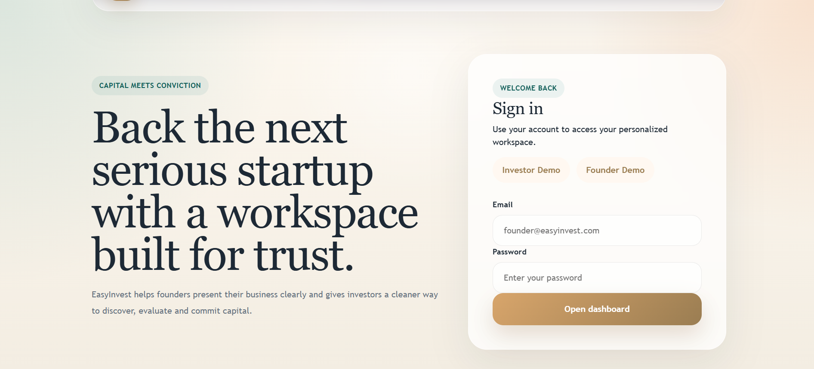
</p>

#### Create Account

<p align="center">
  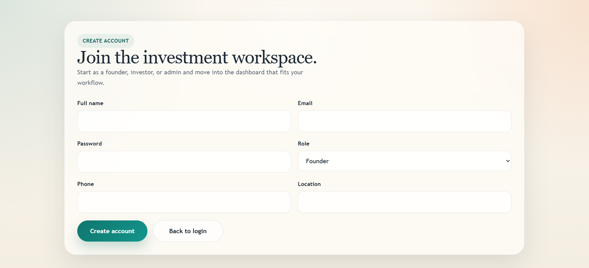
</p>
------------------------------------------------------------------------

### Investor Experience

#### Investor Dashboard
<p align="center">
  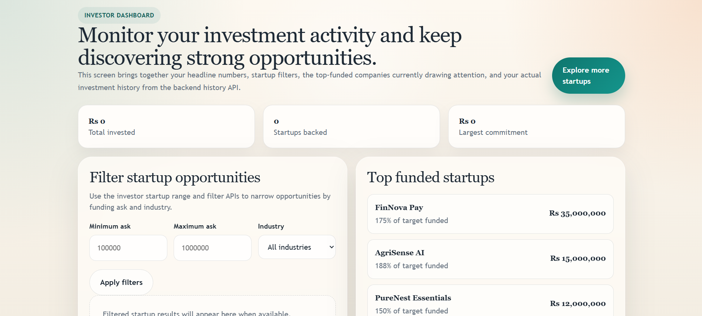
</p>

The investor dashboard combines investment activity, startup filtering,
top-funded startups, and investment history in one workspace.

#### Startup Discovery

<p align="center">
  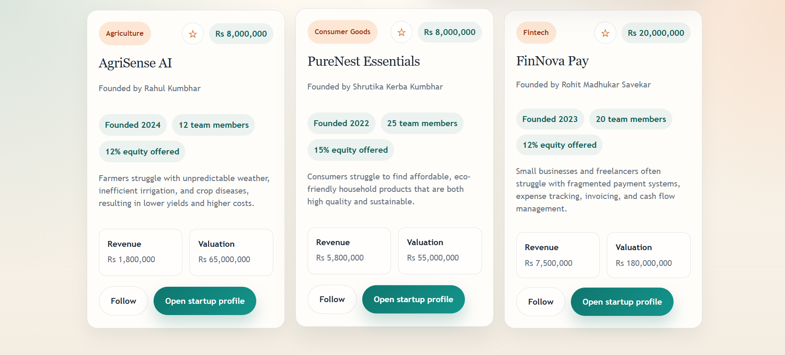
</p>

```
Investors can review startup opportunities using information such as
industry, funding requirements, founding year, team size, equity
offered, revenue, valuation, and problem statement.

#### Saved Startups

<p align="center">
  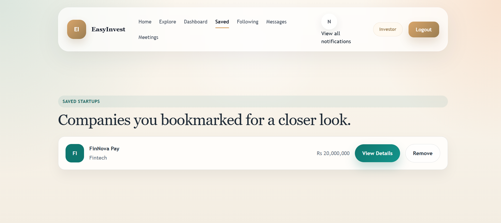
</p>

Investors can bookmark opportunities for later review.

#### Following

<p align="center">
  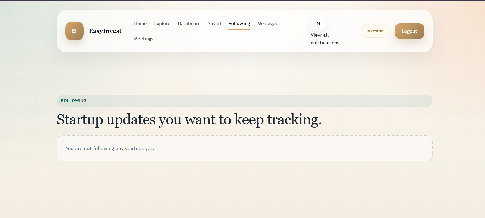
</p>

Investors can follow startups to keep track of opportunities and
updates.

------------------------------------------------------------------------

### Founder Experience

#### Startup Management

<p align="center">
  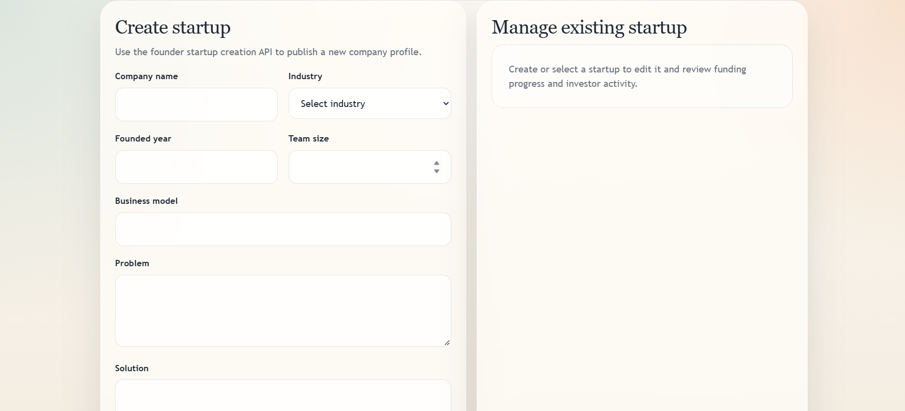
</p>

```
Founders can create startup profiles containing company information,
industry, founding year, team size, business model, problem statement,
and solution details.

------------------------------------------------------------------------

### Communication and Collaboration

#### Meetings

<p align="center">
  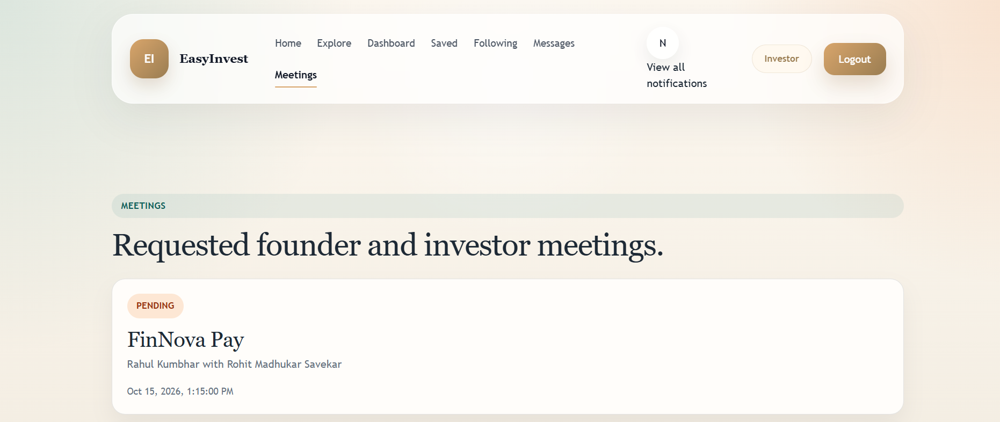
</p>

The platform supports founder-investor meeting requests and meeting
status workflows.

#### Messaging

<p align="center">
  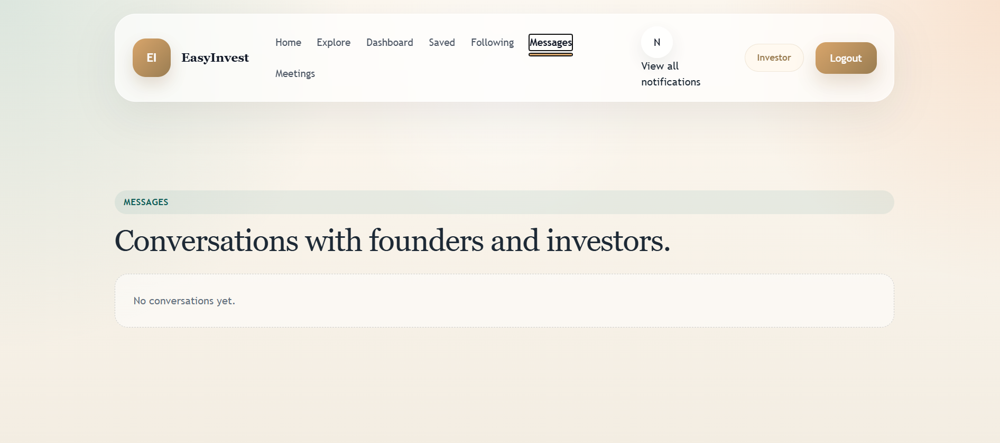
</p>

Founders and investors can communicate through conversations and
messages.

#### Notifications

<p align="center">
  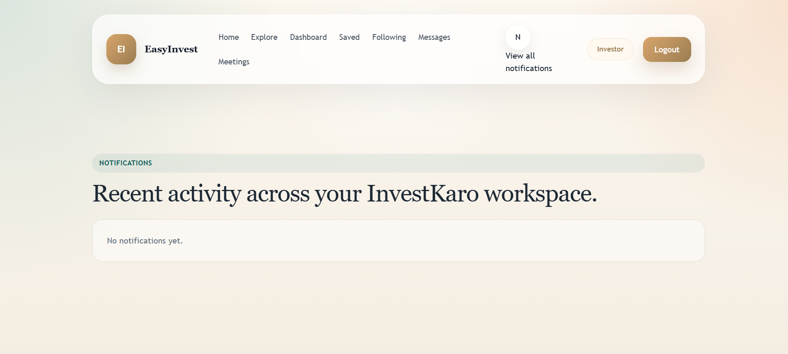
</p>

Notifications provide a centralized view of recent platform activity.

------------------------------------------------------------------------

## Architecture

EasyInvest follows a layered backend architecture with a separate
Angular frontend.

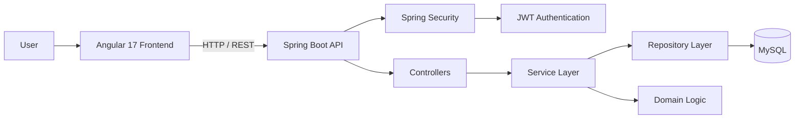

### Backend Layering

``` text
REST Controller
      |
      v
Service Layer
      |
      v
Repository Layer
      |
      v
MySQL
```

The backend separates HTTP handling, business logic, persistence,
security, validation, and domain models.

The codebase contains dedicated packages for:

``` text
config
controller
dto
entity
exception
repository
security
service
```

------------------------------------------------------------------------

## Security Architecture

EasyInvest uses stateless Spring Security with JWT authentication.

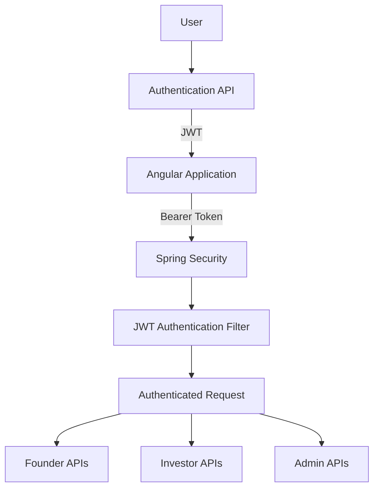

Security implementation includes:

-   Stateless session management
-   JWT token generation and validation
-   Password hashing
-   Role-based endpoint authorization
-   Protected API routes
-   Angular authentication guard
-   Angular role guard
-   JWT HTTP interceptor
-   Public access only for selected endpoints
-   Centralized exception handling

------------------------------------------------------------------------

## Technology Stack

### Backend

  Technology          Purpose
  ------------------- ----------------------------------
  Java 21             Application language
  Spring Boot 4.0.3   Backend framework
  Spring Web MVC      REST API development
  Spring Data JPA     Persistence abstraction
  Hibernate           ORM
  Spring Security     Authentication and authorization
  JJWT 0.11.5         JWT handling
  MySQL               Relational database
  Lombok              Boilerplate reduction
  Maven               Build and dependency management

### Frontend

  Technology       Purpose
  ---------------- -------------------------------
  Angular 17       Frontend framework
  TypeScript       Application development
  RxJS             Reactive programming
  Angular Router   Client-side routing
  Angular SSR      Server-side rendering support
  Bootstrap 5      UI support
  Express          SSR server

### Development

-   Git
-   Maven
-   npm
-   Postman
-   IntelliJ IDEA
-   Visual Studio Code
-   MySQL

------------------------------------------------------------------------

## Backend Modules

The backend is organized around domain-specific controllers, services,
repositories, DTOs, and entities.

``` text
Authentication
Administration
Startup Management
Industry Management
Investment Management
Investor Interest
Bookmarks
Following
Startup Documents
Startup Updates
Conversations
Messages
Meetings
Notifications
```

Representative controllers include:

``` text
AuthController
AdminController
StartupController
IndustryController
InvestmentController
InvestorInterestController
BookmarkController
FollowController
InvestorStartupController
DocumentController
StartupUpdateController
ConversationController
MessageController
MeetingController
NotificationController
```

------------------------------------------------------------------------

## Frontend Structure

The primary Angular application is organized around authentication,
role-specific dashboards, investor workflows, communication, and shared
services.

``` text
investkaro-ui/
└── src/
    └── app/
        ├── admin/
        ├── auth/
        ├── core/
        ├── founder/
        ├── investor/
        ├── meetings/
        ├── messages/
        ├── notifications/
        ├── services/
        └── shared/
```

Important frontend areas include:

-   Authentication
-   Authentication guard
-   Role guard
-   JWT interceptor
-   Investor dashboard
-   Founder dashboard
-   Admin dashboard
-   Startup listing
-   Startup details
-   Saved startups
-   Following
-   Meetings
-   Conversations
-   Chat
-   Notifications

------------------------------------------------------------------------

## Project Structure

``` text
EasyInvest/
│
├── Backend/
│   ├── src/
│   │   ├── main/
│   │   │   ├── java/
│   │   │   │   └── com/investkaro/
│   │   │   │       ├── config/
│   │   │   │       ├── controller/
│   │   │   │       ├── dto/
│   │   │   │       ├── entity/
│   │   │   │       ├── exception/
│   │   │   │       ├── repository/
│   │   │   │       ├── security/
│   │   │   │       └── service/
│   │   │   └── resources/
│   │   └── test/
│   ├── Dockerfile
│   └── pom.xml
│
├── investkaro-ui/
│   ├── src/
│   │   ├── app/
│   │   └── environments/
│   ├── angular.json
│   └── package.json
│
├── Frontend/
│
├── docs/
│   └── images/
│
├── README.md
└── .gitignore
```

`investkaro-ui` is the primary frontend implementation represented by
the current application screenshots. The repository also contains an
earlier `Frontend` application directory.

------------------------------------------------------------------------

## API Domains

The backend exposes REST APIs covering the major application domains:

  Domain              Example Resource
  ------------------- -------------------------
  Authentication      `/auth`
  Startups            `/startups`
  Investor Startups   `/investor/startups`
  Investments         `/investor/investments`
  Investor Interest   `/investor/interest`
  Bookmarks           `/bookmarks`
  Following           `/follow`
  Documents           `/documents`
  Startup Updates     `/startup-updates`
  Conversations       `/conversations`
  Messages            `/messages`
  Meetings            `/meetings`
  Notifications       `/notifications`
  Industries          `/api/industries`
  Administration      `/admin`

The controllers are backed by service and repository layers, keeping
HTTP handling separate from application and persistence logic.

------------------------------------------------------------------------

## Validation and Error Handling

The backend uses Spring validation and centralized exception handling.

The application validates incoming requests before processing operations
and provides dedicated error handling for invalid, unauthorized, and
conflicting requests.

Business rules are implemented in the service layer rather than placing
application logic directly inside controllers.

------------------------------------------------------------------------

## Testing

The repository contains backend and frontend tests.

### Backend

Current backend tests cover:

-   Application context
-   Investment controller behavior
-   Investment service behavior

Run backend tests:

``` bash
cd Backend
mvn test
```

### Frontend

The Angular application contains specifications for:

-   Authentication
-   Authentication guards
-   JWT interceptor
-   Investor services
-   Startup services
-   Dashboard components
-   Startup details
-   Navigation components

Run frontend tests:

``` bash
cd investkaro-ui
npm test
```

------------------------------------------------------------------------

## Getting Started

### Prerequisites

Install:

-   Java 21
-   Maven
-   Node.js
-   npm
-   MySQL
-   Angular CLI

### 1. Clone the repository

``` bash
git clone https://github.com/RahulK9021/EasyInvest.git
cd EasyInvest
```

### 2. Configure MySQL

Create a MySQL database and configure the backend connection using
environment-specific configuration.

Required configuration includes:

``` text
DB_URL
DB_USERNAME
DB_PASSWORD
JWT_SECRET
```

Sensitive values should be supplied through environment variables or an
untracked local configuration file.

Do not commit credentials or JWT secrets to the repository.

### 3. Start the backend

``` bash
cd Backend
mvn clean install
mvn spring-boot:run
```

The development frontend is configured to communicate with the backend
at:

``` text
http://localhost:8090
```

### 4. Start the frontend

Open a second terminal:

``` bash
cd investkaro-ui
npm install
ng serve
```

Open the Angular development server in your browser.

### 5. Build the frontend

``` bash
npm run build
```

------------------------------------------------------------------------

## Configuration

The Angular application uses environment-specific API configuration.

### Development

``` text
http://localhost:8090
```

### Production

The production environment can point to the deployed Spring Boot API.

Database credentials, JWT secrets, and other sensitive values should be
supplied through environment-specific configuration rather than
committed source files.

------------------------------------------------------------------------

## Engineering Highlights

EasyInvest demonstrates practical full-stack engineering across several
areas:

-   Layered Spring Boot architecture
-   REST API design
-   Stateless JWT authentication
-   Role-based authorization
-   Password hashing
-   DTO-based request and response models
-   JPA/Hibernate persistence
-   Business-rule validation
-   Centralized exception handling
-   Angular route guards
-   JWT HTTP interception
-   Startup discovery and filtering
-   Investment tracking
-   Investor engagement workflows
-   Founder-investor communication
-   Automated backend and frontend tests

------------------------------------------------------------------------

## Project Status

The core EasyInvest platform is implemented across the backend and
primary Angular frontend.

  Area                       Status
  -------------------------- -------------
  Authentication             Implemented
  Role-based authorization   Implemented
  Startup management         Implemented
  Startup discovery          Implemented
  Investment workflows       Implemented
  Investor engagement        Implemented
  Documents and updates      Implemented
  Messaging                  Implemented
  Meetings                   Implemented
  Notifications              Implemented
  Founder dashboard          Implemented
  Investor dashboard         Implemented
  Admin operations           Implemented

------------------------------------------------------------------------

## Future Improvements

Potential areas for future development include:

-   Payment gateway integration
-   Advanced investment analytics
-   Investor-startup recommendation engine
-   Expanded automated test coverage
-   CI/CD pipeline
-   Cloud deployment
-   Centralized logging and monitoring
-   Production-grade secret management
-   OpenAPI documentation
-   Performance and scalability improvements

------------------------------------------------------------------------

## Documentation

Detailed engineering documentation can be maintained separately from the
main README:

``` text
docs/
├── ARCHITECTURE.md
├── SECURITY.md
├── API.md
└── DEVELOPMENT.md
```

The README is intentionally focused on the product, architecture,
screenshots, technology stack, and setup process. Deeper implementation
decisions can be documented separately.

------------------------------------------------------------------------

## Author

**Rahul Rajendra Kumbhar**

GitHub: [RahulK9021](https://github.com/RahulK9021)

Project: [EasyInvest](https://github.com/RahulK9021/EasyInvest)

------------------------------------------------------------------------

## License

This project is currently maintained as a personal portfolio project. A
formal open-source license can be added if the repository is intended
for redistribution or external contributions.
